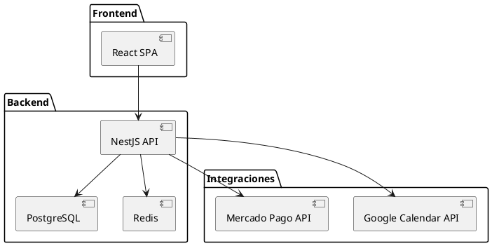
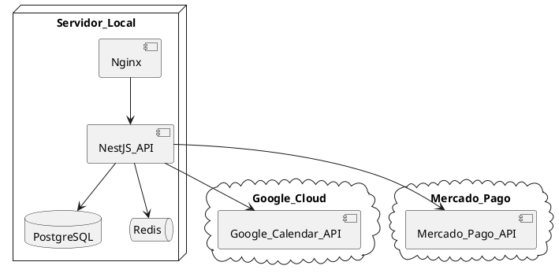

# Documento Técnico – Sistema de Gestión Odontológica (MVP)

## 1. Contexto y alcance

El sistema web gestionará hasta **100 citas diarias** con un máximo de **8 usuarios concurrentes**, alojado inicialmente en un servidor local (4 vCPU, 8 GB RAM, 120 GB SSD). La pila tecnológica acordada es **React + TypeScript** (frontend) y **NestJS** (backend), con **PostgreSQL** como base de datos, **Redis** para colas y caché, y **Nginx** como reverse proxy.

---

## 2. Arquitectura

### 2.1 Vista lógica

```
[React SPA] ──> [Nginx] ──> [NestJS API] ──> [PostgreSQL]
                               │
                               ├── [Redis (BullMQ)]
                               ├── Google Calendar API
                               └── Mercado Pago API
```

### 2.2 Diagramas UML

> Los siguientes fragmentos PlantUML pueden copiarse en cualquier visor PlantUML para generar las imágenes.

#### 2.2.1 Diagrama de componentes



#### 2.2.2 Diagrama de despliegue



---

## 3. Modelo de datos (ER simplificado)

* **paciente**(id\_pk, nombre, apellido, dni, direccion, email, telefono, fecha\_nacimiento, saldo)
* **cita**(id\_pk, paciente\_id\_fk, fecha\_hora, estado, observaciones, created\_by, updated\_at)
* **archivo**(id\_pk, paciente\_id\_fk, ruta, tipo\_mime, descripcion, created\_at)
* **pago**(id\_pk, paciente\_id\_fk, monto, medio, referencia\_externa, created\_at)
* **usuario**(id\_pk, email, hash\_pw, rol)
* **permiso**(id\_pk, nombre)
* **rol\_permiso**(rol\_id\_fk, permiso\_id\_fk)

---

## 4. Requisitos funcionales (RF)

1. **RF‑1**  Crear, editar y eliminar pacientes.
2. **RF‑2**  Adjuntar archivos médicos (radiografías, recetas, PDF, imágenes).
3. **RF‑3**  Consultar historial de citas y pagos dentro de la ficha del paciente.
4. **RF‑4**  Crear, editar y eliminar citas (solo Admin/Moderador).
5. **RF‑5**  Marcar asistencia o inasistencia de las citas.
6. **RF‑6**  Registrar observaciones y recetas por parte del odontólogo.
7. **RF‑7**  Sincronizar citas de forma bidireccional con Google Calendar.
8. **RF‑8**  Mostrar saldo actual del paciente (deuda/anticipo).
9. **RF‑9**  Recibir Webhooks de Mercado Pago y actualizar saldo automáticamente.
10. **RF‑10** Registrar pagos manuales (contingencia).
11. **RF‑11** Widget “Citas del día” en el dashboard con confirmación rápida.
12. **RF‑12** Widgets “Ingresos del día” e “Ingresos del mes”.
13. **RF‑13** Botones rápidos en el dashboard: nuevo paciente, nueva cita, verificar pago.
14. **RF‑14** Refresco automático de widgets cada 3 min + botón de refresco manual por widget.
15. **RF‑15** Gestión de roles: Administrador, Moderador (permisos configurables), Odontólogo.
16. **RF‑16** Pantalla para que el Administrador configure permisos del Moderador.
17. **RF‑17** Edición colaborativa de archivos en Google Docs (fase posterior si el tiempo lo permite).

---

## 5. Requisitos no funcionales (RNF)

1. **RNF‑1**  Tiempo de respuesta < 2 s con 8 usuarios concurrentes y 100 citas/día.
2. **RNF‑2**  Disponibilidad anual ≥ 99 %.
3. **RNF‑3**  Back‑ups completos semanales con retención de 4 semanas.
4. **RNF‑4**  Cifrado TLS en tránsito y cifrado en reposo de archivos de pacientes.
5. **RNF‑5**  Contenedorización y diseño listos para migrar a cloud.
6. **RNF‑6**  Cobertura de pruebas unitarias ≥ 70 % con pipeline CI/CD.

---

## 6. Historias de usuario clave

| ID    | Como       | Quiero                | Para                                |
| ----- | ---------- | --------------------- | ----------------------------------- |
| US‑01 | Admin      | Crear un paciente     | iniciar su historial.               |
| US‑02 | Moderador  | Agendar una cita      | asignar horario en Google Calendar. |
| US‑03 | Odontólogo | Registrar observación | dejar constancia clínica.           |
| US‑04 | Sistema    | Recibir Webhook MP    | actualizar saldo en tiempo real.    |
| US‑05 | Usuario    | Ver dashboard         | tener visión rápida de la jornada.  |

---

## 7. Casos de uso

1. **Gestionar Paciente** – CRUD completo.
2. **Programar Cita** – Verificar disponibilidad y sincronizar con Google Calendar.
3. **Confirmar Asistencia** – Cambiar estado y registrar timestamp.
4. **Registrar Pago** – Procesamiento automático (Webhook) o manual.
5. **Configurar Permisos Moderador** – Habilitar/deshabilitar features.

---

## 8. Componentes y responsabilidades

| Componente           | Descripción                      | Patrones           |
| -------------------- | -------------------------------- | ------------------ |
| *PatientService*     | Lógica de paciente, validaciones | Repository, Mapper |
| *AppointmentService* | Sincroniza citas ↔ Google        | Strategy           |
| *PaymentService*     | Consume Webhooks MP              | Observer, Strategy |
| *DashboardGateway*   | WebSocket para notificaciones    | Observer           |
| *AuthModule*         | JWT, RBAC                        | Guard, Policy      |

---

## 9. End‑points REST (extracto)

| Método | Ruta                      | Rol mínimo | Descripción                   |
| ------ | ------------------------- | ---------- | ----------------------------- |
| GET    | /patients                 | Odontólogo | Lista filtrable de pacientes. |
| POST   | /patients                 | Moderador  | Crear paciente.               |
| GET    | /appointments/today       | Odontólogo | Citas del día.                |
| PATCH  | /appointments/\:id/attend | Moderador  | Marcar asistencia.            |
| POST   | /payments/webhook         | Público    | Callback Mercado Pago.        |

---

## 10. Seguridad y DevOps

* TLS 1.3 en Nginx (Let’s Encrypt).
* BCrypt 12 salt rounds.
* OWASP headers + CORS restrictivo.
* Docker Compose (api, db, redis, nginx) y GitHub Actions para CI/CD.
* Back‑ups: *cron* diario incremental + completo semanal (pg\_dump, rsync archivos).

---

## 11. Plan de pruebas

* **Unitarias:** servicios, repositorios y validaciones (≥ 70 %).
* **Integración:** flujo Paciente → Cita → Pago → Saldo.
* **E2E:** Cypress en rutas críticas.
* **Carga:** 10 usuarios simulados, 20 rps durante 5 min (latencia p95 < 2 s).

---

## 12. Riesgos y mitigación

| Riesgo                               | Impacto | Probabilidad | Plan                                           |
| ------------------------------------ | ------- | ------------ | ---------------------------------------------- |
| Falta de experiencia del dev trainee | Medio   | Alto         | Mentoría externa 2 h/sem; uso de scaffolding.  |
| Dependencia de APIs externas         | Alto    | Medio        | Retries con back‑off, colas y circuit breaker. |
| Crecimiento del almacenamiento local | Alto    | Bajo         | Monitor de disco y alertas al 80 %.            |

---

## 13. Pasos de implementación (sin fechas)

1. **Infraestructura base y autenticación.**
2. **CRUD Paciente** con carga de archivos.
3. **CRUD Citas** y agenda interna.
4. **Sincronización Google Calendar.**
5. **Pagos y Webhook Mercado Pago.**
6. **Dashboard y widgets.**
7. **Pruebas QA y hardening.**

---

**Fin del documento**
